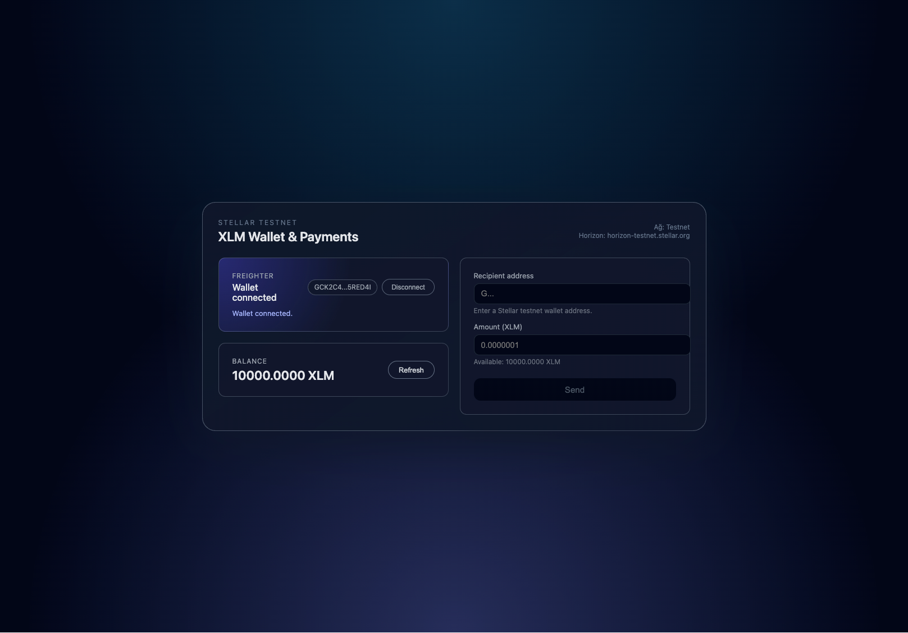
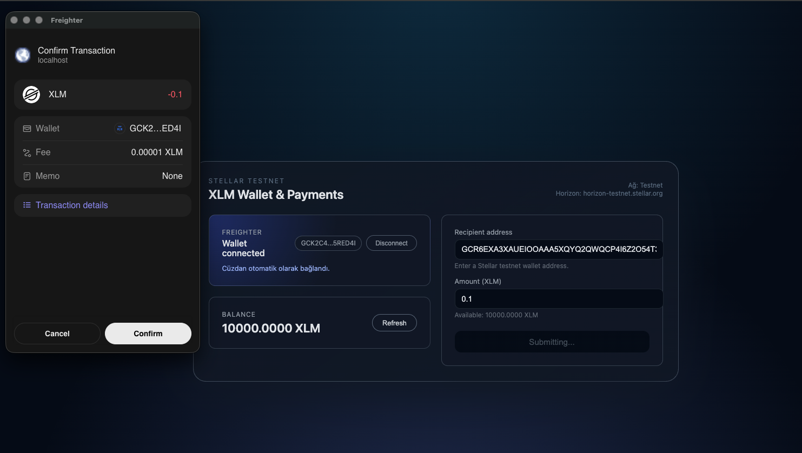
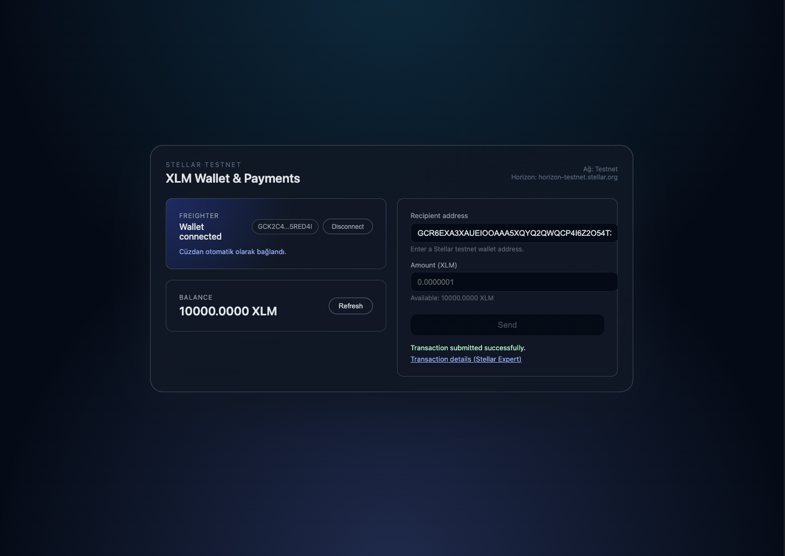
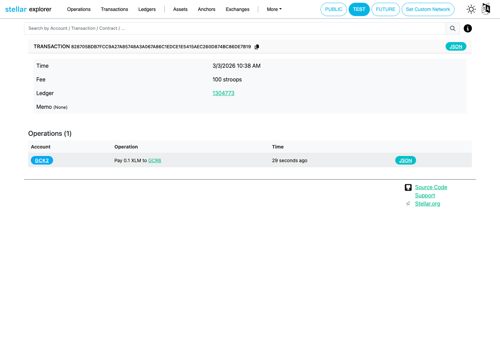
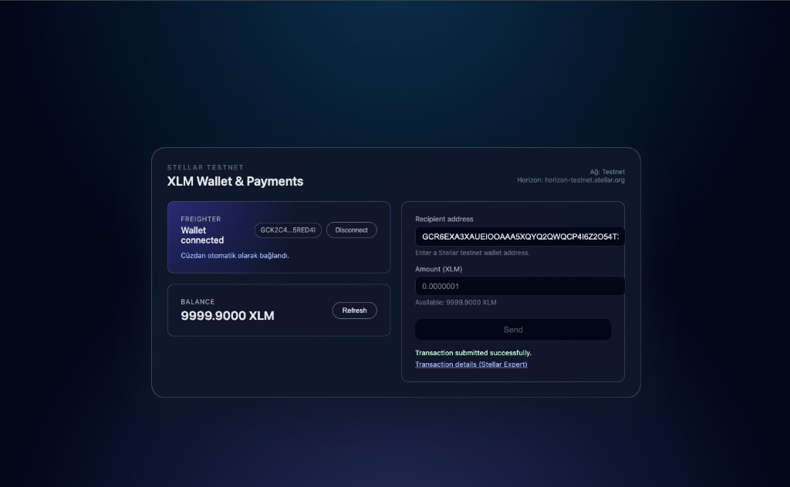

# stellar-white-belt-dapp

A simple **Stellar Testnet payment dApp** that connects to a Freighter wallet on Testnet, shows the wallet’s XLM balance, and sends XLM to another Stellar address with clear transaction feedback.  
This implements the **“Simple Payment dApp – send XLM to any address with amount input”** idea for **Level 1 – White Belt**.

---

## Project Description

- Uses the **Freighter** wallet on **Stellar Testnet** (and is being extended with multi‑wallet support via StellarWalletsKit).
- Lets the user **connect / disconnect** their wallet.
- Fetches and clearly displays the wallet’s **XLM balance**.
- Sends an **XLM payment** to any valid Stellar address on testnet.
- Shows **success or failure** in the UI and links to the transaction on a block explorer.

---

## Setup (How to Run Locally)

### Prerequisites

- Node.js (recommended: **v18+**)
- **Freighter** browser extension installed

### Steps

```bash
# Clone this repository
git clone https://github.com/hulyaozkul/stellar-white-belt-dapp

cd stellar-white-belt-dapp

# Install dependencies
npm install

# Start the development server
npm run dev
```

Vite typically runs the app at `http://localhost:5173`. Open the URL shown in your terminal.

---

## Wallet Setup (Freighter + Testnet)

1. Install the **Freighter** browser extension.  
2. Create a new wallet or use an existing one.  
3. In Freighter settings, select the **Testnet** network.  
4. Fund your public key with testnet XLM using Friendbot (for example via Stellar Laboratory).

---

## How to Use

1. Start the app and open it in your browser.  
2. Click **“Connect with Freighter”** (or another supported wallet) to connect your Testnet wallet.  
3. Check your **XLM balance** in the Balance card (use **Refresh** if needed).  
4. In the **Send payment** form:
   - Enter a **Stellar Testnet address** (starting with `G...`) as the recipient.  
   - Enter the **amount in XLM** to send.  
5. Click **Send** and confirm the transaction in the Freighter popup.  
6. After submission, the app shows whether the transaction succeeded and provides a link to view the transaction on a Stellar explorer.

---

## Level 2 – Yellow Belt

This repository is used for the **Level 2 – Yellow Belt** submission.

### Requirements covered

- **Multi‑wallet integration**: Uses StellarWalletsKit to offer more than one wallet option (e.g. Freighter, xBull) and handle common wallet errors (**wallet not found / unsupported**, **user rejected**, **insufficient balance**).
- **Smart contract on testnet**: A Soroban increment contract lives in `contract/`.
- **Contract deployed on Testnet**  
  - **Deployed contract address (Testnet)**: `CDML4O37AHQGNMCLOAQH4X5UEOMUE3I6HNAI5R3K5E3RDCMH2UTM3SIO`  
  - **Example contract call (increment) tx hash**: `137b15789eacbc9dcfb0b278477aecdfd059ff9a2cc392e8b1958c84689d869c`  
    Verifiable on Stellar Explorer (Testnet):  
    `https://stellar.expert/explorer/testnet/tx/137b15789eacbc9dcfb0b278477aecdfd059ff9a2cc392e8b1958c84689d869c`
- **Contract call from the frontend**: The UI includes an **“Increment counter”** section wired to the deployed contract. The flow builds a Soroban transaction, signs it via the connected wallet, submits it to Soroban RPC, and tracks status (**pending / success / fail**) with a link to view the transaction on a block explorer.
- **Transaction status visible**: Both the payment flow and the contract call surface clear success / failure states and expose the transaction hash + explorer link.

---

## Screenshots

- **Wallet connected state**

  

- **Balance displayed**

  

- **Successful testnet transaction**

  

- **Transaction result shown to the user (with hash/link)**

  

- **Transaction details in Stellar Explorer (optional)**

  

 - **Balance after a successful transaction (optional)**

   


